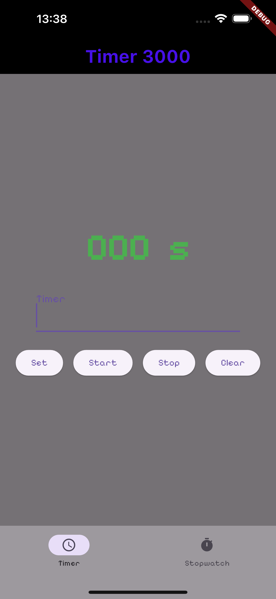
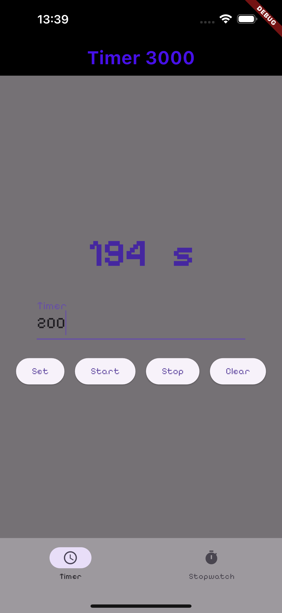
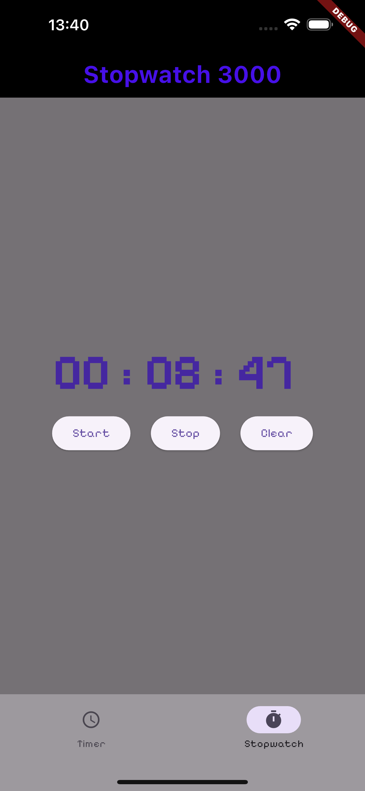

# timer_app

 
 

## Eine einfache Timer und Stopwatch App

Eine Aufgabe aus meinem Kurs zum lernen und verstehen von Futures. 

Aufgabenstellung war:
- Einen Timer oder eine Stopwatch programmieren mit Future.delayed
- Als Bonusaufgabe konnte man beides machen

Zusätzlich habe ich die Timeranzeige auf grün gesetzt, wenn er abgelaufen ist
und Fonts über Themes ausprobiert.

